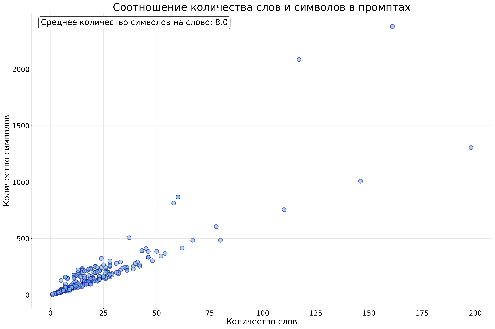
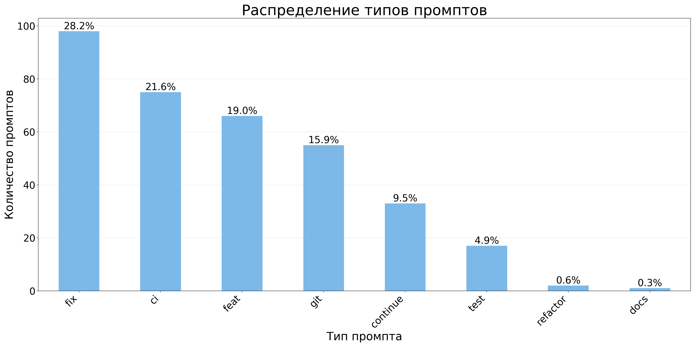
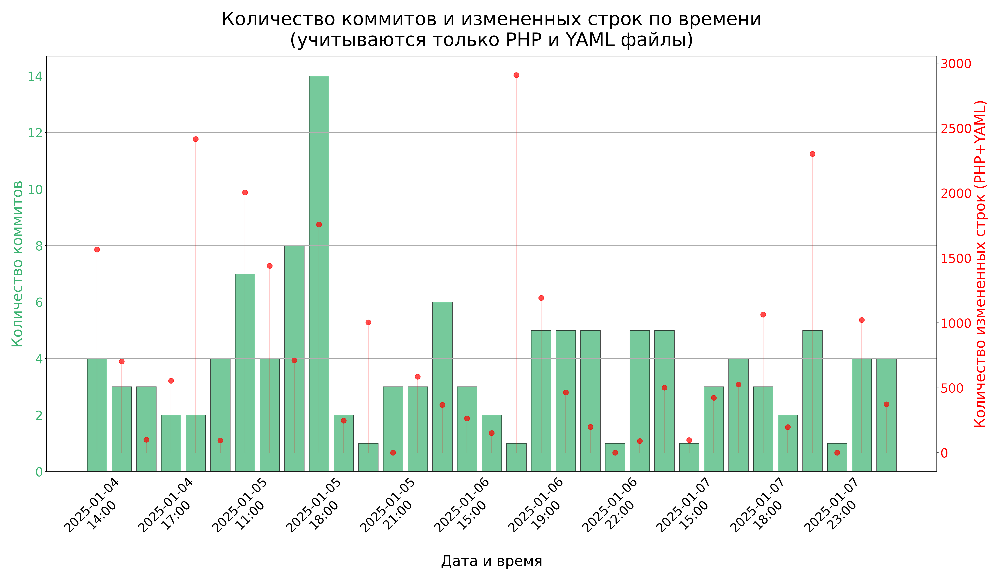
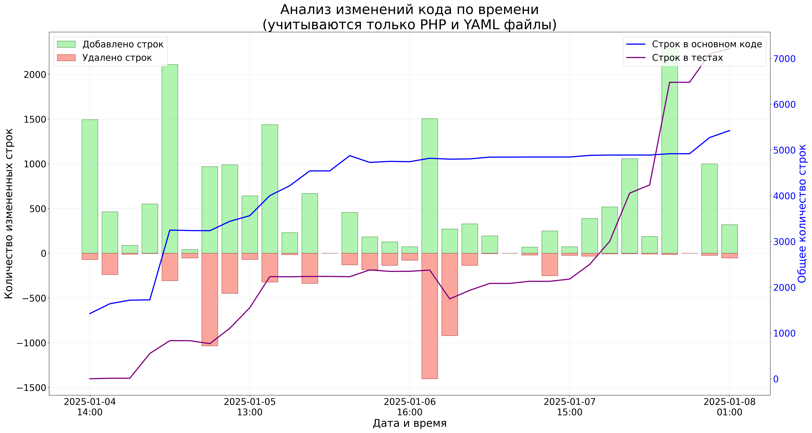

# Анализ разработки с помощью Cursor

## Общая статистика

- Всего промптов: 347
- Всего коммитов: 130
- Среднее количество промптов на коммит: 2.7
- Потрачено часов на проект: 33 (учитываются часы, в которых были коммиты)
- Среднее количество слов в промпте: 17.4
- Среднее количество символов в промпте: 144.4
- Среднее количество коммитов в день: 25.0
- Самый активный час для коммитов: 18:00
- Среднее количество изменений на коммит: 404.5 строк
- Количество строк в основном коде (src): 5,423 строк
- Количество строк в тестах (tests): 7,214 строк
- Соотношение тестов к коду: 133.0%

## Распределение типов промптов

| Тип | Количество | Процент |
|-----|------------|----------|
| fix | 98 | 28.2% |
| ci | 75 | 21.6% |
| feat | 66 | 19.0% |
| git | 55 | 15.9% |
| continue | 33 | 9.5% |
| test | 17 | 4.9% |
| refactor | 2 | 0.6% |
| docs | 1 | 0.3% |

## Графики

### Распределение длины промптов

### Распределение типов промптов

### Активность коммитов по времени

### Анализ изменений кода

## Выводы

1. **Промпты**:
   - Наиболее частый тип промптов: fix (98 промптов)
   - Средняя длина промпта составляет 17.4 слов

2. **Коммиты**:
   - В среднем 25.0 коммитов в день
   - Наибольшая активность наблюдается в 18:00
   - Среднее количество изменений в коммите: 404.5 строк
