# Telegram Bot для учета расходов и доходов - Техническое задание

## 📋 Обзор проекта

Telegram бот для быстрого добавления транзакций в систему учета личных финансов. Бот выступает как самостоятельный клиент для gRPC сервиса бюджета, обеспечивая удобный интерфейс для добавления транзакций через Telegram.

### 🎯 Цели проекта

- **Быстрое добавление транзакций** через Telegram без необходимости открывать веб-интерфейс
- **Интеграция с существующей системой** через gRPC API
- **Умная категоризация** транзакций на основе описания
- **Многопользовательность** с привязкой Telegram аккаунтов к пользователям системы
- **Простота использования** - минимальное количество действий для добавления транзакции

## 🏗️ Архитектура

### Высокоуровневая схема

```mermaid
flowchart TB
    subgraph "Telegram Bot"
        TG[Telegram Bot Service]
        Parser[Message Parser]
        CategoryMatcher[Category Matcher]
        StateManager[State Manager]
        AuthManager[Auth Manager]
    end
    
    subgraph "Budget Service"
        GRPC[gRPC API]
        Auth[Auth Service]
        Transaction[Transaction Service]
        Category[Category Service]
        User[User Service]
    end
    
    subgraph "Storage"
        BotDB[(Bot Database)]
        MainDB[(Main Database)]
    end
    
    TG -->|parse| Parser
    TG -->|match categories| CategoryMatcher
    TG -->|manage state| StateManager
    TG -->|authenticate| AuthManager
    
    AuthManager -->|gRPC| Auth
    Parser -->|create transaction| Transaction
    CategoryMatcher -->|get categories| Category
    StateManager -->|store state| BotDB
    AuthManager -->|store tokens| BotDB
    
    Auth -->|JWT tokens| AuthManager
    Transaction -->|store data| MainDB
    Category -->|get data| MainDB
```



### Компоненты системы

1. **Telegram Bot Service** - основной сервис бота
2. **Message Parser** - парсинг сообщений пользователя
3. **Category Matcher** - сопоставление описаний с категориями
4. **State Manager** - управление состоянием диалога
5. **Auth Manager** - управление аутентификацией
6. **gRPC Client** - клиент для взаимодействия с основным сервисом

## 🔧 Технический стек

### Backend
- **Язык**: Go 1.23+
- **Telegram Bot API**: `github.com/go-telegram-bot-api/telegram-bot-api/v5`
- **gRPC Client**: `google.golang.org/grpc`
- **База данных**: SQLite (для состояния бота)
- **Конфигурация**: Viper + .env (godotenv)
- **Логирование**: Zap
- **Миграции**: golang-migrate

### Структура проекта
```
telegram-bot/
├── cmd/
│   └── bot/
│       └── main.go
├── internal/
│   ├── bot/
│   │   ├── handler.go
│   │   ├── parser.go
│   │   ├── category_matcher.go
│   │   ├── state_manager.go
│   │   └── auth_manager.go
│   ├── grpc/
│   │   ├── client.go
│   │   ├── auth_client.go
│   │   ├── transaction_client.go
│   │   └── category_client.go
│   ├── domain/
│   │   ├── user_session.go
│   │   ├── transaction_draft.go
│   │   └── category_mapping.go
│   ├── repository/
│   │   ├── session_repo.go
│   │   ├── category_mapping_repo.go
│   │   └── user_repo.go
│   └── pkg/
│       ├── config/
│       ├── logger/
│       └── utils/
├── migrations/
├── configs/
├── docker/
└── docs/
```

## 🔐 Аутентификация и привязка аккаунтов

### Схема привязки Telegram к пользователям

1. **Регистрация через бота**:
   - Пользователь отправляет `/start`
   - Бот предлагает зарегистрироваться или войти
   - При регистрации запрашивает email и пароль
   - Создает пользователя в основной системе через gRPC
   - Привязывает Telegram ID к пользователю

2. **Вход через бота**:
   - Пользователь отправляет `/login`
   - Бот запрашивает email и пароль
   - Проверяет учетные данные через gRPC Auth Service
   - Сохраняет JWT токены для последующих запросов
   - Привязывает Telegram ID к существующему пользователю

3. **Хранение сессий**:
   ```sql
   CREATE TABLE user_sessions (
       telegram_id BIGINT PRIMARY KEY,
       user_id UUID NOT NULL,
       tenant_id UUID NOT NULL,
       access_token TEXT NOT NULL,
       refresh_token TEXT NOT NULL,
       access_token_expires_at TIMESTAMP NOT NULL,
       refresh_token_expires_at TIMESTAMP NOT NULL,
       created_at TIMESTAMP DEFAULT CURRENT_TIMESTAMP,
       updated_at TIMESTAMP DEFAULT CURRENT_TIMESTAMP
   );
   ```

### Команды аутентификации

- `/start` - начало работы с ботом
- `/login` - вход в систему
- `/register` - регистрация нового пользователя
- `/logout` - выход из системы
- `/switch_tenant` - переключение между организациями
- `/language` - выбор языка интерфейса
- `/currency` - настройка валюты по умолчанию

## 💬 Парсинг сообщений

### Формат сообщений

Бот принимает сообщения в следующем формате:

```
[дата] [+]сумма[валюта] описание
```

Где:
- `[дата]` - необязательное поле:
  - Пропущено (используется текущая дата)
  - "сегодня", "вчера", "позавчера"
  - В формате "DD.MM.YYYY" или "DD.MM"
- `[+]` - необязательный знак для доходов (без знака = расход)
- `сумма` - число с точкой или запятой для копеек
- `[валюта]` - необязательное поле:
  - Пропущено (используется валюта тенанта по умолчанию)
  - Символ валюты: ₽, $, €, £, ¥
  - Код валюты: RUB, USD, EUR, GBP, JPY
- `описание` - текстовое описание транзакции

### Примеры сообщений

```
1000 продукты
+50000 зарплата
01.12 5000 подарок
12.12.2023 1234.56 такси
вчера 100 кофе
сегодня +1000 возврат

# С указанием валюты
1000₽ продукты
+50000$ зарплата
01.12 5000 EUR подарок
12.12.2023 1234.56 USD такси
вчера 100 RUB кофе
сегодня +1000 GBP возврат
```

### Алгоритм парсинга

1. **Разбор даты**:
   - Проверка ключевых слов ("сегодня", "вчера", "позавчера")
   - Парсинг форматов "DD.MM.YYYY" и "DD.MM"
   - Валидация корректности даты

2. **Разбор суммы**:
   - Поиск числа с возможной точкой/запятой
   - Определение типа транзакции по знаку "+"
   - Конвертация в minor units (копейки)

3. **Разбор валюты**:
   - Поиск символов валют (₽, $, €, £, ¥)
   - Поиск кодов валют (RUB, USD, EUR, GBP, JPY)
   - Валидация корректности валюты
   - Конвертация в стандартный формат

4. **Извлечение описания**:
   - Остальная часть сообщения после суммы и валюты
   - Очистка от лишних пробелов

## 🏷️ Система категоризации

### Автоматическое сопоставление категорий

1. **База сопоставлений**:
   ```sql
   CREATE TABLE category_mappings (
       id UUID PRIMARY KEY DEFAULT gen_random_uuid(),
       tenant_id UUID NOT NULL,
       keyword TEXT NOT NULL,
       category_id UUID NOT NULL,
       priority INTEGER DEFAULT 0,
       created_at TIMESTAMP DEFAULT CURRENT_TIMESTAMP,
       UNIQUE(tenant_id, keyword)
   );
   ```

2. **Алгоритм сопоставления**:
   - Поиск точных совпадений ключевых слов
   - Поиск частичных совпадений (подстроки)
   - Учет приоритета сопоставлений
   - Возврат наиболее подходящей категории

3. **Команды управления категориями**:
   - `/categories` - список доступных категорий
   - `/map слово = категория` - добавить сопоставление
   - `/map слово` - показать текущее сопоставление
   - `/map --all` - показать все сопоставления
   - `/unmap слово` - удалить сопоставление

### Умные подсказки

1. **Анализ истории**:
   - Анализ часто используемых описаний
   - Предложение категорий на основе похожих транзакций
   - Машинное обучение для улучшения точности

2. **Контекстные подсказки**:
   - Учет времени суток и дня недели
   - Учет геолокации (если доступна)
   - Учет регулярных транзакций

## 🔄 Управление состоянием

### Состояния диалога

```go
type DialogState string

const (
    StateIdle DialogState = "idle"
    StateWaitingForAmount DialogState = "waiting_for_amount"
    StateWaitingForDescription DialogState = "waiting_for_description"
    StateWaitingForCategory DialogState = "waiting_for_category"
    StateWaitingForDate DialogState = "waiting_for_date"
    StateWaitingForEmail DialogState = "waiting_for_email"
    StateWaitingForPassword DialogState = "waiting_for_password"
    StateConfirmingTransaction DialogState = "confirming_transaction"
)
```

### Черновик транзакции

```go
type TransactionDraft struct {
    ID          string
    TelegramID  int64
    Type        TransactionType
    Amount      *Money
    Description string
    CategoryID  string
    OccurredAt  *time.Time
    CreatedAt   time.Time
}
```

### Хранение состояния

```sql
CREATE TABLE dialog_states (
    telegram_id BIGINT PRIMARY KEY,
    state TEXT NOT NULL,
    draft_id UUID,
    context JSONB,
    created_at TIMESTAMP DEFAULT CURRENT_TIMESTAMP,
    updated_at TIMESTAMP DEFAULT CURRENT_TIMESTAMP
);

CREATE TABLE user_preferences (
    telegram_id BIGINT PRIMARY KEY,
    language TEXT DEFAULT 'ru',
    default_currency TEXT,
    created_at TIMESTAMP DEFAULT CURRENT_TIMESTAMP,
    updated_at TIMESTAMP DEFAULT CURRENT_TIMESTAMP
);
```

## 📊 API интеграция

### gRPC клиенты

1. **Auth Client**:
   - Регистрация пользователей
   - Аутентификация
   - Обновление токенов

2. **Transaction Client**:
   - Создание транзакций
   - Получение списка транзакций
   - Получение статистики

3. **Category Client**:
   - Получение списка категорий
   - Создание категорий
   - Управление категориями

4. **User Client**:
   - Получение профиля пользователя
   - Управление организациями

### Обработка ошибок

1. **Сетевые ошибки**:
   - Retry механизм с экспоненциальной задержкой
   - Fallback на локальное кеширование
   - Уведомления пользователя о проблемах

2. **Ошибки аутентификации**:
   - Автоматическое обновление токенов
   - Перенаправление на повторную аутентификацию
   - Очистка недействительных сессий

## 🎨 Пользовательский интерфейс

### Типы сообщений

1. **Текстовые сообщения**:
   - Простые ответы
   - Списки категорий
   - Статистика

2. **Inline клавиатуры**:
   - Выбор категорий
   - Подтверждение действий
   - Навигация по меню

3. **Reply клавиатуры**:
   - Быстрые команды
   - Часто используемые суммы
   - Шаблоны транзакций

### Примеры интерфейса

```
💰 Добавлена транзакция:
📅 15.12.2023
💸 Расход: 1,000.00 ₽
🏷️ Категория: Питание
📝 Описание: продукты

✅ Транзакция сохранена в системе
```

```
Выберите категорию для "такси":

🚗 Транспорт
🍽️ Питание  
🏠 Дом
🎯 Другое
```

## 📈 Статистика и аналитика

### Команды статистики

- `/stats` - общая статистика за текущий месяц
- `/stats 2023-12` - статистика за конкретный месяц
- `/stats week` - статистика за текущую неделю
- `/top_categories` - топ категорий по расходам
- `/recent` - последние 10 транзакций

### Метрики бота

1. **Пользовательские метрики**:
   - Количество активных пользователей
   - Количество транзакций в день
   - Среднее время добавления транзакции

2. **Технические метрики**:
   - Время ответа API
   - Количество ошибок
   - Использование памяти и CPU

## 🔧 Конфигурация

### Переменные окружения

```bash
# Telegram
TELEGRAM_BOT_TOKEN=your_token_here
TELEGRAM_API_BASE_URL=http://127.0.0.1:3001/
TELEGRAM_DEBUG=true
TELEGRAM_UPDATES_TIMEOUT=30

# gRPC
GRPC_SERVER_ADDRESS=127.0.0.1:8080
GRPC_INSECURE=true

# Database
DATABASE_DRIVER=sqlite3
DATABASE_DSN=file:./data/bot.sqlite3?_foreign_keys=on

# Logging
LOG_LEVEL=debug

# Metrics
METRICS_ENABLED=false
METRICS_ADDRESS=:9090

```

Пример `.env`: см. `env.example`.
```

### Конфигурационные файлы

```yaml
# configs/config.yaml
telegram:
  token: ${TELEGRAM_BOT_TOKEN}
  webhook_url: ${TELEGRAM_WEBHOOK_URL}
  timeout: 30s

grpc:
  server_address: ${GRPC_SERVER_ADDRESS}
  tls_enabled: ${GRPC_TLS_ENABLED}
  timeout: 10s
  retry_attempts: 3

database:
  url: ${DATABASE_URL}
  max_connections: 10
  connection_timeout: 5s

logging:
  level: ${LOG_LEVEL}
  format: ${LOG_FORMAT}

metrics:
  enabled: ${METRICS_ENABLED}
  port: ${METRICS_PORT}

security:
  jwt_secret: ${JWT_SECRET}
  session_timeout: 24h
```

## 🚀 План разработки

### Этап 1: Базовая инфраструктура (1-2 недели)

1. **Настройка проекта**:
   - Создание структуры проекта
   - Настройка Go модулей
   - Конфигурация Docker
   - Настройка CI/CD

2. **База данных**:
   - [x] Миграции SQLite (`migrations/0001_init.*.sql`)
   - [x] Инит и автопрогон миграций при старте (`internal/pkg/db`)
   - [x] Репозитории: sessions, dialog_state, preferences, category_mappings

3. **gRPC клиенты**:
   - [ ] Сборка pb из proto (`make proto`)
   - [ ] Auth Client (временный fake, заменить на реальный)
   - [ ] Transaction Client
   - [ ] Category Client

### Этап 2: Аутентификация и пользователи (1 неделя)

1. **Система аутентификации**:
   - [x] Команды `/login`, `/register`, `/logout` (диалоги)
   - [x] Сохранение сессии (SQLite)
   - [ ] gRPC интеграция с Auth (заменить fake)

2. **Привязка Telegram к пользователям**:
   - Связывание Telegram ID с пользователями
   - Управление несколькими организациями
   - Переключение между организациями

### Этап 3: Парсинг сообщений (1 неделя)

1. **Парсер сообщений**:
   - [x] Базовый парсинг дат (сегодня, вчера, позавчера, DD.MM(.YYYY))
   - [x] Разбор сумм и типа транзакции (+ доход, иначе расход)
   - [x] Валюта (символы/коды) — базовая поддержка
   - [ ] Валидация и сообщения об ошибках

2. **Валидация данных**:
   - Проверка корректности дат
   - Валидация сумм
   - Обработка ошибок парсинга

### Этап 4: Система категоризации (1-2 недели)

1. **База сопоставлений**:
   - Таблица category_mappings
   - API для управления сопоставлениями
   - Алгоритм поиска категорий

2. **Команды управления**:
   - `/categories` - список категорий
   - `/map` - управление сопоставлениями (в процессе)
   - `/unmap` - удаление сопоставлений (в процессе)

3. **Умные подсказки**:
   - Анализ истории транзакций
   - Предложение категорий
   - Контекстные подсказки

### Этап 5: Управление состоянием (1 неделя)

1. **State Manager**:
   - Состояния диалога
   - Черновики транзакций
   - Сохранение контекста

2. **Интерактивные диалоги**:
   - Запрос недостающих данных
   - Подтверждение транзакций
   - Отмена операций

### Этап 6: Пользовательский интерфейс (1 неделя)

1. **Типы сообщений**:
   - Текстовые ответы
   - Inline клавиатуры
   - Reply клавиатуры

2. **Форматирование**:
   - Красивые сообщения о транзакциях
   - Статистика и отчеты
   - Списки категорий

### Этап 7: Статистика и аналитика (1 неделя)

1. **Команды статистики**:
   - `/stats` - общая статистика
   - `/top_categories` - топ категорий
   - `/recent` - последние транзакции

2. **Метрики и мониторинг**:
   - Prometheus метрики
   - Логирование
   - Алерты

### Этап 8: Тестирование и оптимизация (1 неделя)

1. **Тестирование**:
   - Unit тесты
   - Integration тесты
   - E2E тесты

2. **Оптимизация**:
   - Производительность
   - Использование памяти
   - Время ответа

3. **Документация**:
   - README
   - API документация
   - Руководство пользователя

## 📋 Команды бота

### Основные команды

- `/start` - начало работы с ботом
- `/help` - справка по командам
- `/login` - вход в систему
- `/register` - регистрация
- `/logout` - выход из системы

### Управление транзакциями

- `1000 продукты` - добавить расход
- `+50000 зарплата` - добавить доход
- `01.12 5000 подарок` - добавить с датой
- `1000₽ продукты` - добавить расход в рублях
- `+50000$ зарплата` - добавить доход в долларах
- `/cancel` - отменить текущую операцию

### Управление категориями

- `/categories` - список категорий
- `/map слово = категория` - добавить сопоставление
- `/map слово` - показать сопоставление
- `/map --all` - все сопоставления
- `/unmap слово` - удалить сопоставление

### Статистика

- `/stats` - статистика за месяц
- `/stats 2023-12` - статистика за период
- `/stats week` - статистика за неделю
- `/top_categories` - топ категорий
- `/recent` - последние транзакции

### Настройки

- `/profile` - профиль пользователя
- `/switch_tenant` - переключение организации
- `/language` - выбор языка интерфейса
- `/currency` - настройка валюты по умолчанию
- `/settings` - настройки бота
- `/export` - экспорт данных

## 🌍 Мультиязычность и мультивалютность

### Поддержка языков

Бот поддерживает несколько языков интерфейса:

1. **Русский (ru)** - основной язык
2. **Английский (en)** - международный язык
3. **Дополнительные языки** - по мере необходимости

#### Выбор языка при первом входе

```go
func (h *Handler) handleStart(ctx context.Context, update tgbotapi.Update) error {
    // Отправка приветственного сообщения с выбором языка
    keyboard := tgbotapi.NewInlineKeyboardMarkup(
        tgbotapi.NewInlineKeyboardRow(
            tgbotapi.NewInlineKeyboardButtonData("🇷🇺 Русский", "lang_ru"),
            tgbotapi.NewInlineKeyboardButtonData("🇺🇸 English", "lang_en"),
        ),
    )
    
    msg := tgbotapi.NewMessage(update.Message.Chat.ID, 
        "Выберите язык / Choose language:")
    msg.ReplyMarkup = keyboard
    
    return h.bot.Send(msg)
}
```

#### Локализованные сообщения

```go
type LocalizedMessages struct {
    messages map[string]map[string]string
}

var messages = map[string]map[string]string{
    "ru": {
        "welcome": "Добро пожаловать в бот учета финансов!",
        "transaction_added": "Транзакция добавлена",
        "select_category": "Выберите категорию",
        "amount": "Сумма",
        "description": "Описание",
        "date": "Дата",
        "category": "Категория",
        "income": "Доход",
        "expense": "Расход",
    },
    "en": {
        "welcome": "Welcome to the finance tracking bot!",
        "transaction_added": "Transaction added",
        "select_category": "Select category",
        "amount": "Amount",
        "description": "Description",
        "date": "Date",
        "category": "Category",
        "income": "Income",
        "expense": "Expense",
    },
}
```

### Поддержка валют

#### Валюты по умолчанию

1. **Российский рубль (RUB)** - основная валюта
2. **Доллар США (USD)** - международная валюта
3. **Евро (EUR)** - европейская валюта
4. **Дополнительные валюты** - по мере необходимости

#### Парсинг валют в сообщениях

```go
type CurrencyParser struct {
    symbolToCode map[string]string
    codeToSymbol map[string]string
}

func (cp *CurrencyParser) ParseCurrency(text string) (string, string, error) {
    // Поиск символов валют
    currencySymbols := map[string]string{
        "₽": "RUB",
        "$": "USD", 
        "€": "EUR",
        "£": "GBP",
        "¥": "JPY",
    }
    
    // Поиск кодов валют
    currencyCodes := []string{"RUB", "USD", "EUR", "GBP", "JPY"}
    
    // Извлечение валюты из текста
    for symbol, code := range currencySymbols {
        if strings.Contains(text, symbol) {
            return code, symbol, nil
        }
    }
    
    for _, code := range currencyCodes {
        if strings.Contains(strings.ToUpper(text), code) {
            return code, cp.codeToSymbol[code], nil
        }
    }
    
    return "", "", nil // валюта не указана
}
```

#### Конвертация валют

```go
type CurrencyConverter struct {
    fxClient grpc.FxClient
    logger   *zap.Logger
}

func (cc *CurrencyConverter) ConvertToBaseCurrency(
    amount *Money, 
    fromCurrency string, 
    toCurrency string,
    date time.Time,
) (*Money, error) {
    if fromCurrency == toCurrency {
        return amount, nil
    }
    
    // Получение курса валют через gRPC
    rate, err := cc.fxClient.GetExchangeRate(context.Background(), &pb.GetExchangeRateRequest{
        FromCurrency: fromCurrency,
        ToCurrency:   toCurrency,
        Date:         timestamppb.New(date),
    })
    
    if err != nil {
        return nil, fmt.Errorf("failed to get exchange rate: %w", err)
    }
    
    // Конвертация суммы
    convertedAmount := amount.MinorUnits * int64(rate.Rate*10000) / 10000
    
    return &Money{
        MinorUnits: convertedAmount,
        Currency:   toCurrency,
    }, nil
}
```

#### Настройка валюты по умолчанию

```go
func (h *Handler) handleCurrency(ctx context.Context, update tgbotapi.Update) error {
    // Отображение доступных валют
    keyboard := tgbotapi.NewInlineKeyboardMarkup(
        tgbotapi.NewInlineKeyboardRow(
            tgbotapi.NewInlineKeyboardButtonData("₽ RUB", "currency_RUB"),
            tgbotapi.NewInlineKeyboardButtonData("$ USD", "currency_USD"),
        ),
        tgbotapi.NewInlineKeyboardRow(
            tgbotapi.NewInlineKeyboardButtonData("€ EUR", "currency_EUR"),
            tgbotapi.NewInlineKeyboardButtonData("£ GBP", "currency_GBP"),
        ),
    )
    
    msg := tgbotapi.NewMessage(update.Message.Chat.ID, 
        "Выберите валюту по умолчанию:")
    msg.ReplyMarkup = keyboard
    
    return h.bot.Send(msg)
}
```

### Интеграция с основной системой

#### Получение валюты тенанта

```go
func (h *Handler) getTenantDefaultCurrency(ctx context.Context, tenantID string) (string, error) {
    // Получение информации о тенанте через gRPC
    tenant, err := h.tenantClient.GetTenant(ctx, &pb.GetTenantRequest{
        Id: tenantID,
    })
    
    if err != nil {
        return "RUB", err // валюта по умолчанию
    }
    
    return tenant.DefaultCurrency, nil
}
```

#### Форматирование сумм

```go
type MoneyFormatter struct {
    locale string
}

func (mf *MoneyFormatter) FormatMoney(amount *Money, locale string) string {
    switch locale {
    case "ru":
        return fmt.Sprintf("%.2f %s", float64(amount.MinorUnits)/100, amount.Currency)
    case "en":
        return fmt.Sprintf("%s %.2f", amount.Currency, float64(amount.MinorUnits)/100)
    default:
        return fmt.Sprintf("%.2f %s", float64(amount.MinorUnits)/100, amount.Currency)
    }
}
```

### Примеры использования

#### Сообщения с валютой

```
# Без указания валюты (используется валюта тенанта)
1000 продукты

# С символом валюты
1000₽ продукты
+50000$ зарплата
200€ подарок

# С кодом валюты
1000 RUB продукты
+50000 USD зарплата
200 EUR подарок

# С датой и валютой
01.12 5000₽ подарок
вчера 100$ кофе
сегодня +1000 EUR возврат
```

#### Локализованные ответы

```
🇷🇺 Русский:
💰 Добавлена транзакция:
📅 15.12.2023
💸 Расход: 1,000.00 ₽
🏷️ Категория: Питание
📝 Описание: продукты

🇺🇸 English:
💰 Transaction added:
📅 15.12.2023
💸 Expense: $1,000.00
🏷️ Category: Food
📝 Description: groceries
```

## 🔒 Безопасность

### Защита данных

1. **Шифрование**:
   - JWT токены в зашифрованном виде
   - HTTPS для всех соединений
   - Шифрование чувствительных данных в БД

2. **Аутентификация**:
   - Проверка Telegram ID
   - Валидация JWT токенов
   - Автоматическое обновление токенов

3. **Авторизация**:
   - Проверка прав доступа к организациям
   - Изоляция данных между пользователями
   - Логирование действий

### Обработка ошибок

1. **Сетевые ошибки**:
   - Retry с экспоненциальной задержкой
   - Circuit breaker для защиты от сбоев
   - Graceful degradation

2. **Ошибки пользователя**:
   - Понятные сообщения об ошибках
   - Подсказки по исправлению
   - Логирование для анализа

## 📊 Мониторинг и логирование

### Метрики Prometheus

```go
var (
    transactionsTotal = prometheus.NewCounterVec(
        prometheus.CounterOpts{
            Name: "bot_transactions_total",
            Help: "Total number of transactions created",
        },
        []string{"type", "status"},
    )
    
    responseTime = prometheus.NewHistogramVec(
        prometheus.HistogramOpts{
            Name: "bot_response_time_seconds",
            Help: "Bot response time in seconds",
        },
        []string{"command"},
    )
    
    activeUsers = prometheus.NewGauge(
        prometheus.GaugeOpts{
            Name: "bot_active_users",
            Help: "Number of active users",
        },
    )
)
```

### Структурированное логирование

```go
logger.Info("transaction_created",
    zap.String("telegram_id", telegramID),
    zap.String("user_id", userID),
    zap.String("transaction_id", transactionID),
    zap.String("type", transactionType),
    zap.Float64("amount", amount),
    zap.String("category", category),
)
```

## 🚀 Развертывание

### Docker

```dockerfile
FROM golang:1.23-alpine AS builder
WORKDIR /app
COPY go.mod go.sum ./
RUN go mod download
COPY . .
RUN CGO_ENABLED=0 GOOS=linux go build -a -installsuffix cgo -o bot ./cmd/bot

FROM alpine:latest
RUN apk --no-cache add ca-certificates
WORKDIR /root/
COPY --from=builder /app/bot .
COPY --from=builder /app/configs ./configs
CMD ["./bot"]
```

### Docker Compose

```yaml
version: '3.8'
services:
  telegram-bot:
    build: .
    environment:
      - TELEGRAM_BOT_TOKEN=${TELEGRAM_BOT_TOKEN}
      - GRPC_SERVER_ADDRESS=budget-service:8080
      - DATABASE_URL=sqlite:///data/bot.db
    volumes:
      - ./data:/root/data
    ports:
      - "9090:9090"  # metrics
    depends_on:
      - budget-service
```

### Kubernetes

```yaml
apiVersion: apps/v1
kind: Deployment
metadata:
  name: telegram-bot
spec:
  replicas: 2
  selector:
    matchLabels:
      app: telegram-bot
  template:
    metadata:
      labels:
        app: telegram-bot
    spec:
      containers:
      - name: bot
        image: telegram-bot:latest
        env:
        - name: TELEGRAM_BOT_TOKEN
          valueFrom:
            secretKeyRef:
              name: telegram-secrets
              key: bot-token
        ports:
        - containerPort: 9090
          name: metrics
```

## 📈 Масштабирование

### Горизонтальное масштабирование

1. **Stateless архитектура**:
   - Все состояние в базе данных
   - Возможность запуска нескольких экземпляров
   - Load balancing через nginx

2. **Кеширование**:
   - Redis для кеширования категорий
   - Кеширование пользовательских сессий
   - Кеширование сопоставлений

3. **Мониторинг**:
   - Метрики производительности
   - Алерты при превышении лимитов
   - Автоматическое масштабирование

### Оптимизация производительности

1. **База данных**:
   - Индексы для быстрого поиска
   - Партиционирование по датам
   - Connection pooling

2. **gRPC**:
   - Keep-alive соединения
   - Connection pooling
   - Retry с backoff

3. **Telegram API**:
   - Webhook вместо polling
   - Batch обработка сообщений
   - Rate limiting

## 🔮 Будущие улучшения

### Функциональные улучшения

1. **Голосовые сообщения**:
   - Распознавание речи
   - Голосовое добавление транзакций
   - Голосовые отчеты

2. **Фото чеков**:
   - OCR для извлечения данных
   - Автоматическое заполнение транзакций
   - Хранение фото чеков

3. **Уведомления**:
   - Напоминания о регулярных платежах
   - Уведомления о превышении бюджета
   - Еженедельные отчеты

4. **Интеграции**:
   - Банковские API
   - Кассовые аппараты
   - Электронные кошельки

### Технические улучшения

1. **Машинное обучение**:
   - Улучшение категоризации
   - Предсказание расходов
   - Аномальное обнаружение

2. **Аналитика**:
   - Детальная аналитика расходов
   - Тренды и прогнозы
   - Сравнение периодов

3. **Экспорт данных**:
   - Экспорт в различные форматы
   - Интеграция с внешними сервисами
   - Автоматическая синхронизация

---

**Статус документа**: 📋 Готов к реализации

Данная спецификация содержит полное техническое задание для разработки Telegram бота учета расходов и доходов. Все компоненты детально описаны с учетом интеграции с существующей gRPC системой.
